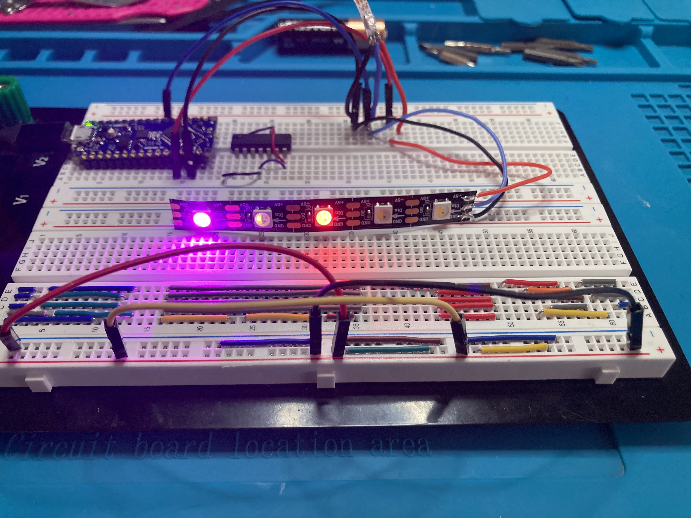
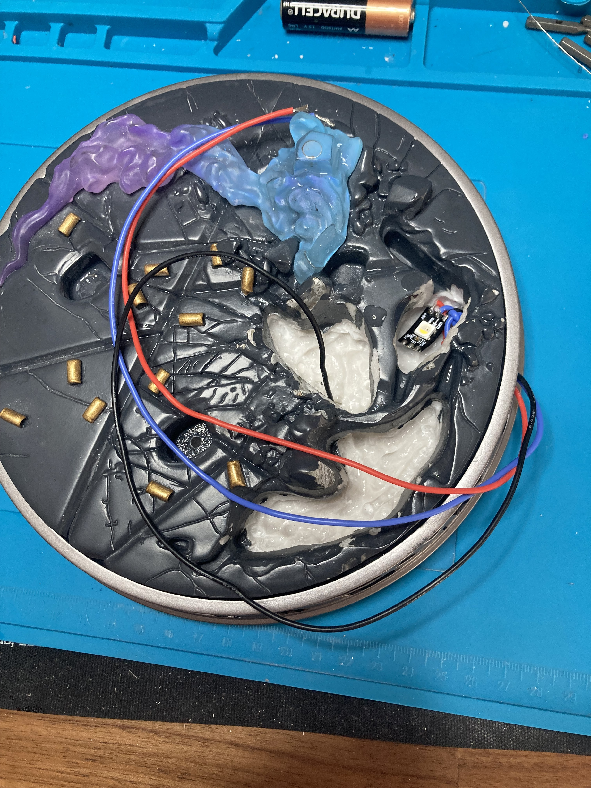
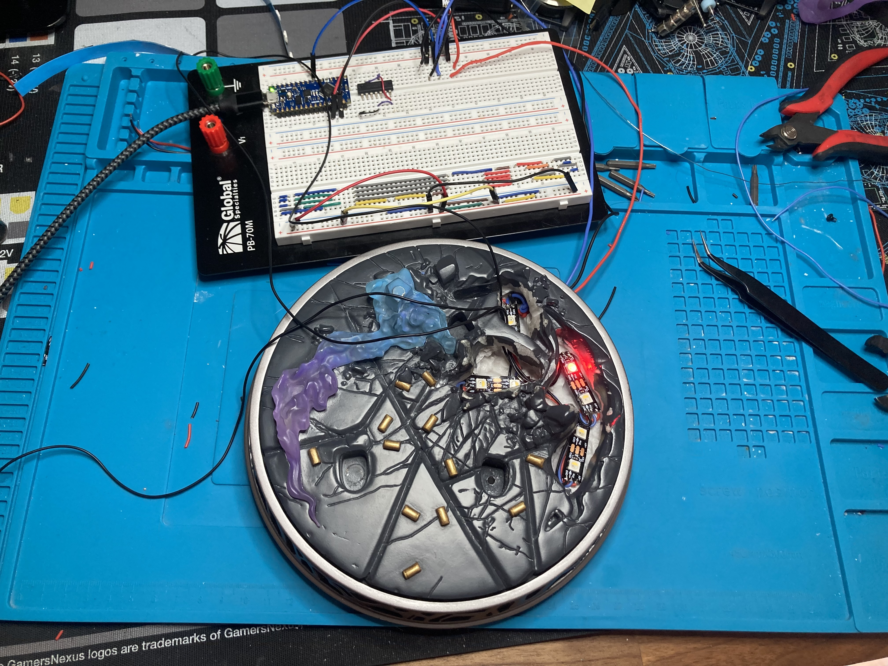
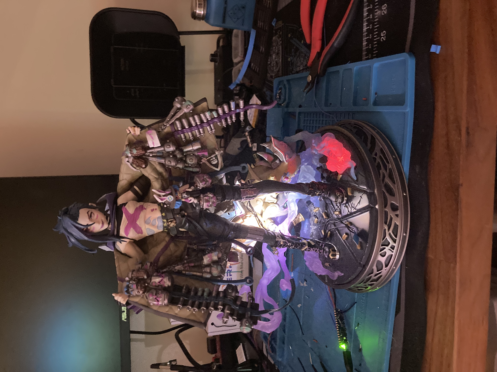

# Jinx LED Engine

---

## ✨ Animated Showcase  
*(Place your GIF below — full-width recommended)*

---

## ⚙️ Engineering Summary

The **Jinx LED Engine** is a custom embedded lighting controller designed for a Jinx statue display.  
It runs on an **Arduino Nano Every** and drives **14× GRBW SK6812 NeoPixels** using two independent real-time animation engines:

- **Cloud Lightning Engine (LEDs 0–11)**  
  Randomized micro-timed lightning flashes running under diffused acrylic "clouds."

- **Core Breathing Engine (LEDs 12–13)**  
  A cinematic breathing and color-mode core for the statue’s central energy node.

The system uses fully non-blocking scheduling (`millis()`), enabling deterministic timing and multi-layered physical lighting depth.

---

## 🌩️ Cloud Lightning Engine (LEDs 0–11)

- Independent micro-timed LED engines  
- ~70% ambient glow baseline  
- Random lightning bursts  
- Intensity & interval variation per LED  
- Designed for translucent cloud diffusion  
- **Goal:** dynamic "storm under glass" motion

---

## 💗 Core Breathing Engine (LEDs 12–13)

- Fade-in → hold → fade-out breathing cycle  
- Color-mode states: Pink / Amethyst / White / Gem-tones  
- Half or full brightness scaling per cycle  
- Mode changes only at blackout for seamless transitions  
- **Goal:** rhythmic “energy core” pulse

---

## 🧱 System Architecture

### 1. Cloud Lightning Engine
- Lightning probability per LED  
- Brightness shaping  
- Randomized timing windows  

### 2. Core Breathing Engine
- Mode selection logic  
- Per-cycle brightness multiplier  
- Controlled color palette  

### Hardware Stack
- Arduino Nano Every  
- 14× GRBW SK6812 LEDs  
- 5 V regulated rail  

### Software Stack
- PlatformIO  
- Adafruit NeoPixel  
- VS Code  
- Git (SSH)

---

## 📸 Gallery

   
  <b>Prototype Sparkle Engine</b> — early breadboard validation of timing, colour curves, and GRBW output.

   
  <b>Internal Lighting Layout</b> — cloud-zone LEDs (0–11) positioned under the acrylic diffusion layer.

   
  <b>Nano Every Driver Board</b> — standalone control stack running both animation engines with non-blocking scheduling.

   
  <b>Cloud Lightning Effect</b> — randomized micro-bursts firing through the diffused resin cloud structure.

   
  <b>Final Assembly</b> — full integration inside the statue base, balanced diffusion, and ambient colour temperature tuning.

---
